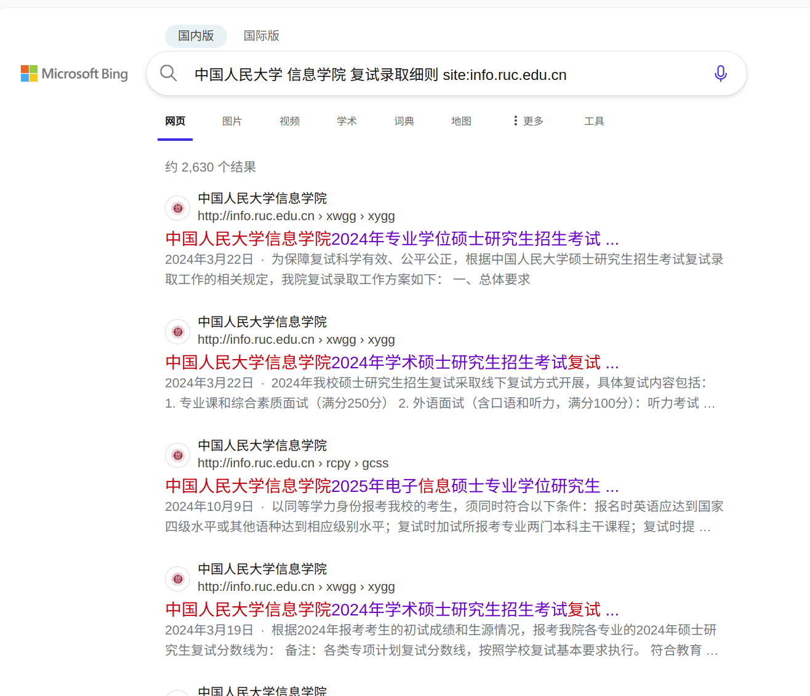

# 南京大学软件学院学硕

### 0.前言

我在大学前两年的时候并没有什么明确的目标，课基本都去听了，但对于未来没有规划过，至于工作还是读研也没深入了解过，挺多课认真去上了，也有挺多课没咋学，完全依照学校安排的课程学吧。结果就是绩点不高不低，对于留学没想过，工作也没想过，保研也没仔细了解过，最后也不能保研，工作的话技术栈也不够，留学似乎也来不及，就只能考研了。所以我觉得提前规划一下还是有好处，不至于被推着走，可能自己会多一些选择的权利。考完研后每天没什么事情，我大一入学前看过上交生存手册，只是当时对大学生活不甚了解，所以虽然看了，但也没什么收获。考完研这段时间一直很闲，前几天我又打开看了看，回想曾经的一些迷茫，顿觉如果一个人如果在入学的时候就有人更详细地告诉他入学后你选择怎样的方式度过这四年会带来怎样的结果，也许他会更好的度过四年。然后把想法先告诉了几个关系不错且去向都不同的同学，就有了你们看到的这个网站。

### 1. 去向与背景

录取学校：南京大学 软件学院 学硕\
科目：11408，总分339，408专业课122，数学84，政治66，英语67\
我的总分并不高，初试在最后一名，招6进9，8-9初试同分，初试平均分362.4分，第6名357比我高18分。南软复试初试分数是初始500复试300，二者相加得总分，所以实际是复试高出1分，总分就能挽回一分。我能上岸真的是三成靠运气了，因为南软学硕比较冷门所以低分进了复试。复试的时候分数还可以排第三名，最后总分第六名擦线录取，学硕里面机试没有比我高的。所以我最大的感受就是考研有时候真的选择大于努力，因此我主要想讲讲择校。

### 2. 复习经验

对于每科的复习经验大家可以参考其他高分同学的，我的408分数还可以，所以就讲讲408吧，我分数还可以我觉得很大一部分原因我觉得是复习的比较仔细。除了王道的四本书和所有真题，我还主要参考了一些教材，很多人觉得黑书更好，更通俗易懂，但我觉得有时候看黑书有些“political right”，因为出题的依据还是国内教材，很多东西是国内教材有而我们上专业课用的黑书上没有的，但确实有些内容黑书介绍的会更容易理解。所以总体来说在教材上我都参考的国内几本教材，也就是谢希仁的计算机网络，唐朔飞的计算机组成原理，汤小丹的计算机操作系统，再加上一本袁春风的计算机系统基础。为什么加这本书呢？因为有许多计算机组成原理的内容，要是觉得计组里面一些细节不太明白看一看这本书对应章节，写的比其他书都清楚，而且细节交代的很明白，尤其是对于中断处理、异常、cache的一些细节如果不明白可以参考对应内容。涉及具体型号的机器或者复杂的例题可以跳过，重点在于一些概念或执行上的细节。

做完所有真题我觉得408出题趋势就是有120分的题的知识点是已经出过的，然后加上30分左右的新知识，毕竟四本书量大管饱深入挖掘总能挖出一些没考过的点。把历年真题做上两遍达到非常熟练，全部理解了以后考110分是没有问题的，再想要拿到更高的分数就需要把更多题目背后知识的细节搞明白。想冲刺130分我觉得非常考验记忆力和应变能力，因为同样的知识出题方式会变，而且总会有一些新内容加入，更考验复习的全面性。我的复习节奏大概就是5-7月看王道，做课后选择题，8-10月结合课本深入复习，并回顾之前的错题且把大题做了。由于王道课后题包含了除去前一年之外所有历年真题，所以这时已经相当于完成了对真题的第一轮复习。11-12月就是拿真题全真模拟，这期间我做了所有真题，平均分大概132分，比我最后分数高了10分，我觉得会差10分是因为这些真题考过的知识点王道都已经加入书中，而且测试时其实已经是第二遍做题，所以自然测试分数会高。所以要想拿更高分数，大家可以复习更全面一些。

最后这部分讲讲我数学上的教训，我数学分数很低，我觉得是刷题太少了，我只做了一遍19-25的真题和4套张宇模拟卷就去考试了。中间大量时间浪费在张宇的强化36讲上，25年这本书改版，仅仅高数厚达600页，很容易学了后面忘了前面，而且耗费时间巨大，导致到后面做题时间大大减少。由于我开始的不算太早，到5月份才差不多正式进入状态，我觉得如果从2-3开始看这套书比较合适，因为他的内容很适合冲刺高分，但是像我这样时间没那么宽裕，更应该多刷题暴露问题后改进再刷题，而不是花大量时间在听课做课后题上。因为模拟和做课后题是完全不同的。希望大家引以为戒，避免重蹈覆辙。

### 3. 择校

考研择校尤其是在11408这一科目选择上会有很多备选学校，我在考研过程中也经历了反复比较和选择的过程，在这一过程中我也有许多思考。\
首先最重要的肯定是分数，也我觉得3个因素很重要，学校历年复试线，历年平均分，最后一个很多人都没提到过，但我觉得对择校非常重要，就是你认为这个学校“值”多少分。历年复试线和平均分我们可以看出每年学校分数线的大致走势和学生水平。如果平均分比分数线高出很多，说明学校当年只是因为最后几名分数较低，想要被录取，最好要看初试中录取名次那一名的分数，比如招9进6，就要看第六名的分数。如果擦线进入复试你可能需要在复试中逆袭许多的分数才可能上岸。但我觉得更重要的是你觉得这个学校值多少分，拿软微举例，我觉得这种级别，360-370分数线，380-390平均分也不算过分，毕竟软微也是北大，清北独一档，这是毫无争议的。这样即便前一年可能爆冷分数线只有350，但你有了自己的估计后自己仍会明白自己应该参考怎样的分数。\
这种估计就要在求得历年平均分的平均分基础上综合考虑学校的层次、地理位置、计算机的学科水平乃至校园环境。比如南京大学的智能科学与技术，师资非常雄厚，院长是院士且是南京大学的党委书记，学院资源自然非常充足。学院老师背景都很强，而且研究方向基本都是AI里面很热门的领域，在苏州校区整个校园环境都非常好。但是由于校区2022年才开始招生，很多人对这个学院都没听说过，前几年都比较冷门。综合他的条件，我觉得这种层次的专业，他的分数线即便是专硕也值得江苏11408分数线345，平均分365-375。在考前有个小程序叫呱呱严选，有实时报录比，这个学院一度达到了10:1，这个小程序人数还是比较准确，所以最后我没有选择报名这个学院，最后分数线337，均分356，比我认为的价值整体低10分左右。我觉得一是因为了解这个学院或者说南大苏州校区的人仍不是很多，再就是互联网行业北上广深更有便于就业实习，再综合成本，北京的学校会很受青睐。\
我觉得对专业分数线有合理预期，才不容易出现低分高报。再就是复旦和上交专硕由于3年总费用大约在20w以上，导致分数线在华五专硕中偏低。其次就是一些招生人数很少的学硕，分数波动往往非常大，经常出现过山车的走势，如果你有足够的实力，又想冲一把，可以考虑选择这些，他们风险很高，但是如果当年没人敢报，最后收益也极高，但如果实力不够，要做好二战的准备。比如我考的软件学院的学硕，这个学院专硕很热门，但是学硕几乎无人知晓，加上软件学院资源和老师往往不及计算机学院的配置，常年分数线较低，这时历年平均分参考意义不大，因为低于学校的价值，我觉得他的价值一般在350左右的分数线，360-370的平均分。我考的这一年虽然分数线只有339，但是均分已经来到了362分。如果你真的想冲好学校而且对复试非常自信，可以尝试报考这种可能低分进复试的专业，但也要做好分数极其爆炸的准备，毕竟招6个人，随便来几个380+的人就把名额占满了。但从我这一年结果来看，敢于冲刺小池子的人是比较少的，高分同学还是更青睐大池子，但小池子里往往也会有高手出现，这个时候就看运气好不好了，也就是选择小池子的高手多不多了。\
再比如南京大学计算机学院或者人工智能学院这种科目强势，师资雄厚，名声在外的学院的专业，他们即便是专硕，分数线一般也会在350-360分以上，历年平均分在370-380左右更是不足为奇，学硕分数甚至会更高一个层次。\
最后我想说我们报考不能只考虑这个专业哪里好，因为人都是贪婪的，它的好处你想占，其他人也会想占，就比如很多人吹嘘的南京大学软件学院专硕，25年之前他分数低，学校层次高，还是两年制，放实习有助于就业，二战失利报考能与前一年应届上岸的人同时毕业，25年第一年改考408是优中之优，结果最后复试线高达372分，这足以说明大众充满了盲从，有时候逆流而行，未必是坏事。所以我觉得要综合它的好处和弊端，结合历年分数，对这个专业的价值进行估计。好处就加分，比如学校层次高、老师都很优秀、资源多待遇口碑俱佳、地理位置优越尤其是北京上海等可以加分，而学院在学校相对弱势、地理位置不好等就可以减分。前期可以先了解信息，估计能力确定科目和大致的目标，比如选11408还是22408，可以将一些学校备选，到了报名前，前一年真题评估下自己的水平再进行报名。

### 4. 信息获取

既然要选择，就存在许多博弈，而做决策需要信息的，尤其需要准确的信息。有许多有用的公众号或小程序，我当时经看灰灰考研。如果你在小程序或公众号获得的信息不全，或者想获取更准确权威的专业分数线、录取名额等信息，可以参考下面的内容。我觉得下面的方法是在你确定一个学校目标专业相关信息的时候，最准确，最好的办法。

首先需要了解的就是学校该专业历年的录取分数线，虽然现在有很多小程序和网站可以找到这些信息，但是往往存在年份缺失或信息不准确。一般每年进入复试的人数、分数线、最终录取人数(复试后可能会变)、复试科目和复试初试分数占比这些信息会在一个叫做"XX大学XX学院20XX年硕士研究生招生考试复试录取细则"的文件公布，大家想要查找哪一年的初试信息，就可以直接按照上述格式搜索。以中国人民大学的信息学院为例，大家可以按照我图1中的方式按照关键词搜索，人大比较特殊，它的学硕和专硕分开发布的，所以大家看清楚标题，如果不符合再加入新的关键字即可。结果未必是学校官网，因为有许多信息平台会备份学校当年发布的页面，所以官网如果撤下了，在那些备份的页面也可以找到。如果你想更精准的搜索，可以试试搜索指令，因为在学院官网的站内查找功能很多都很难用，想要用搜索引擎站内查找可以用图2的方式在前面说的关键字最后加上site:info.ruc.edu.cn进行查找(info.ruc.edu.cn即人民大学信息学院域名)，这样结果都是发布在信息学院官网的页面，对于其他学校比如山大计算机学院就可以使site:cs.sdu.edu.cn，大家可以先找到官网，确定域名后再详细查找，提高效率。

<figure><figcaption>
图1：法复试录取细则
</figcaption></figure>

<figure><figcaption>
图2：精确搜索
</figcaption></figure>

\
这样就可以得到历年的复试分数线，进入复试的每个人的初试成绩，还有复试科目、复试的分数占比等等信息。**其中可以对比历年复试科目有没有变化，这点很重要，因为有时候复试科目会改变，所以一定要确定好复试科目。初试结束后也最好尽早准备复试，多去网上看看复试考察的内容，对于计算机，项目和机试往往很重要。**

其次就是要了解所报名专业今年招生人数，这个一般每年十月份会在研招网的硕士目录里面更新，按照具体院校和专业查询即可。这里仍然以人民大学为例，从图3可以看到每一个方向都是19，因为今年合并招生，即学硕一共招19个人。最终招生名额在绝大多数情况下都不会比这个少，有时会扩招，但是并不建议抱有侥幸心理按照扩招后的名额来报名，关键时候会送命。

<figure><figcaption>
图3：研招网信息
</figcaption></figure>

最后就是专业的初试科目和学费，是否提供宿舍等等，一般会在一个叫做"XX大学20XX年硕士研究生招生章程（简章）的文件发布"，里面详细说明了各个专业的学制和学费，以及是否提供住宿等信息，以南京大学为例，如图4-5，可以看到学制学费，奖助体系，宿舍等信息，南京大学除了苏州校区专硕不提供宿舍，但是奖学金是全覆盖的。

<figure><figcaption>
图4：招生简章1
</figcaption></figure>

<figure><figcaption>
图5：招生简章2
</figcaption></figure>

\
以上就是初步的信息获取，当然在网上也有很多公众号、小程序的数据库，如果图方便可以看看，如果不想付费，尤其是你只查询几个学校，就可以选择上面的方式，保证了信息的准确性。总结一下就是大家要关注三个文件：1.XX大学XX学院20XX年研究生招生考试服饰录取细则，2.研招网硕士目录，3.XX大学20XX年硕士研究生招生章程(简章)。这三个文件所在的网站更是最重要的三个网站，那就是报考专业所在学院的官网，研招网还有学校的研究生招生网。除了以上的信息，后续的复试承诺书、复试总成绩、拟录取公示、拟录取后调档通知、考研报名调剂等等信息都会在这三个网站发布。

### 5. 写在最后

在考研过程中，只要进了复试，不要因为和有效名次最后一个人分数差距比较大就选择放弃，提前复习复试科目，更不要在出分之前就放弃，因为很可能扩招最后你进入复试，出分之后也会有扩招的可能，一定要坚持到最后一刻，不要留下遗憾！而且人生的路很长，一时的挫折不意味着彻底失败，当你50岁回头看过去的几十年，晚一年上岸研究生，对你的人生真的影响那么大吗？何况即便是上岸的人，很可能只是运气比你好罢了。有什么问题可以联系我qq:1078314987。
